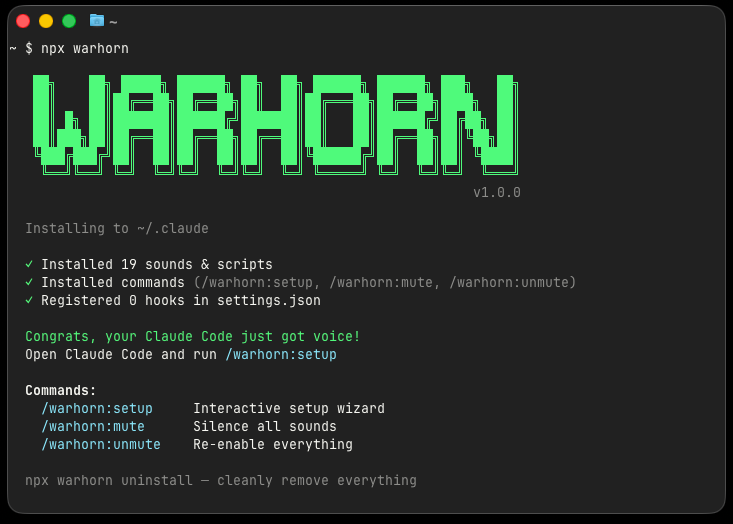

<div align="center">

# WARHORN

**Give your [Claude Code](https://docs.anthropic.com/en/docs/claude-code) a Voice**

Never miss the end of a long task, a permission request, or a failed tool call again. Chimes, alerts, and AI voice lines — your choice.

<br>

```bash
npx warhorn
```

<br>



</div>

---

## What is warhorn?

Claude Code runs in the terminal — no visual cues, no push notifications, no sound. If you step away or switch tabs during a long task, you have no idea when it's done, when it needs approval, or when something breaks.

warhorn fixes that. It hooks into Claude Code's lifecycle events and plays sounds when things happen:

- **Instrumental chimes** — bundled WAV files that work immediately, no setup needed
- **AI voice lines** — short, punchy character voice clips generated via [edge-tts](https://github.com/rany2/edge-tts) (free Microsoft TTS)
- **Both** — instrumentals and voice lines mixed randomly per hook
- **Fully customizable** — pick which hooks trigger sounds, choose a voice preset and personality tone, or describe your own

## Getting Started

### 1. Install Claude Code (if you haven't already)

```bash
# macOS / Linux
curl -fsSL https://claude.ai/install.sh | bash

# Windows (PowerShell)
irm https://claude.ai/install.ps1 | iex
```

Verify it's working:
```bash
claude --version
```

> Need help? See the [official setup guide](https://code.claude.com/docs/en/setup).

### 2. Install warhorn

```bash
npx warhorn
```

warhorn installs itself as a Claude Code plugin — sounds, scripts, commands, and hooks all set up automatically.

### 3. Configure

Open Claude Code in any project directory and run:

```
/warhorn:setup
```

The interactive wizard walks you through picking your hooks, sound type, voice, and personality.

## How It Works

**1. Pick your hooks** — Choose which Claude Code events should play sounds (task complete, permission needed, errors, etc.)

**2. Pick your sound type** — Instrumental chimes, AI voice lines, or both

**3. Pick your voice** — If using voice lines, choose a voice preset and personality tone (sarcastic, grumpy, enthusiastic, dramatic, or describe your own)

**4. Generate** — Claude Code writes custom voice lines and generates WAV files via edge-tts. Done.

```
~/.claude/warhorn/
├── sounds/
│   ├── Stop/               ← random .wav plays when Claude finishes
│   │   ├── chime.wav
│   │   └── voice_1.wav
│   ├── PostToolUseFailure/  ← plays when a tool fails
│   ├── PermissionRequest/   ← plays when Claude needs approval
│   └── ...                  ← 14 hook folders total
└── scripts/
    ├── play-sound.sh        ← picks random file, plays it
    └── generate_voices.py   ← generates WAVs via edge-tts
```

## Commands

Once installed, you have access to these commands in Claude Code:

- `/warhorn:setup` — Interactive setup wizard — pick hooks, sound type, voice character
- `/warhorn:mute` — Mute all sounds
- `/warhorn:unmute` — Unmute sounds

## Voice Presets

| Preset | Voice |
|--------|-------|
| `male_deep` | Australian male, deep and gruff |
| `male_mid` | British male, mid-pitch (default) |
| `female_mid` | British female, mid-pitch |
| `female_high` | American female, bright and high |

### Personality tones

| Tone | Vibe | Example |
|------|------|---------|
| **sarcastic** | Makes fun of you | "Done. You're welcome." |
| **grumpy** | Hates everything | "Done. Go away." |
| **enthusiastic** | Annoyingly excited | "WOOHOO! Done!" |
| **informational** | Just the facts | "Response complete." |
| **dramatic** | Over the top epic | "The quest is complete!" |

You can also describe a **custom** personality during `/warhorn:setup` and Claude will write voice lines for it.

## Supported Hooks

| Hook | Default sound | When it fires |
|------|:---:|-------------|
| `Stop` | chime, success, bell | Claude finishes responding |
| `SessionStart` | boot, ready | Session begins |
| `SessionEnd` | shutdown | Session ends |
| `PostToolUseFailure` | buzz, sad, wonk | Tool fails |
| `PermissionRequest` | alert, doorbell | Claude needs approval |
| `Notification` | ping, bubble | Claude sends notification |
| `SubagentStart` | spawn | Subagent spawns |
| `SubagentStop` | return | Subagent finishes |
| `TaskCompleted` | victory | Task marked complete |
| `PreCompact` | warning | Context compaction starting |
| `UserPromptSubmit` | tick, tap | You submit a prompt |
| `PreToolUse` | _(empty)_ | Before every tool call |
| `PostToolUse` | _(empty)_ | After every tool call |
| `TeammateIdle` | _(empty)_ | Team member idles |

## Add Your Own Sounds

Drop any audio file into a hook folder:

```bash
cp ~/my-sound.wav ~/.claude/warhorn/sounds/Stop/
```

Supported formats: `.wav` (recommended), `.mp3`, `.aiff`, `.ogg`

## Requirements

- **macOS** — Works out of the box (`afplay` is built in)
- **Linux** — Needs `pulseaudio` or `alsa-utils` for sounds
- **Voice lines** (optional) — `pip install edge-tts` + internet

## Uninstall

```bash
npx warhorn uninstall
```

Cleanly removes sounds, commands, and hooks from `~/.claude/settings.json`.

## License

MIT © [Alex Levadski](https://github.com/alevadski)

---

<div align="center">

**Congrats, your Claude Code just got voice!**

[Report Bug](https://github.com/alexlevadski/warhorn/issues) · [Request Feature](https://github.com/alexlevadski/warhorn/issues)

</div>
